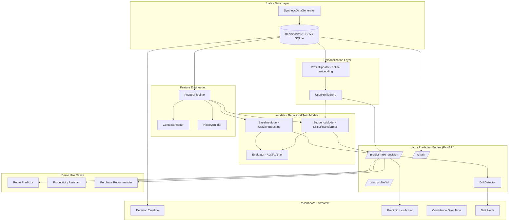
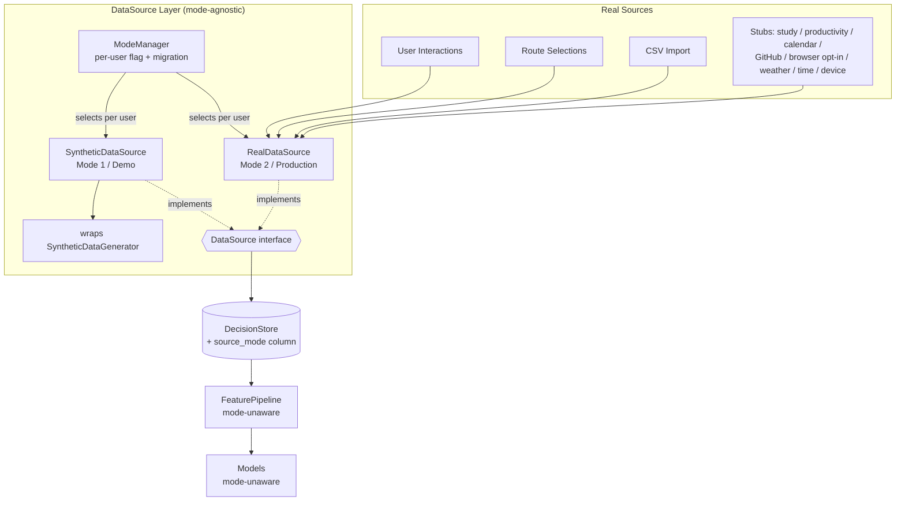
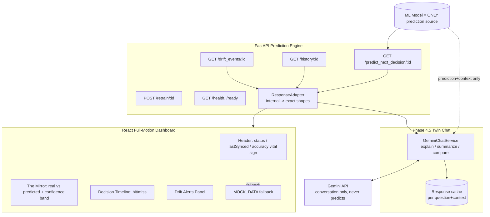
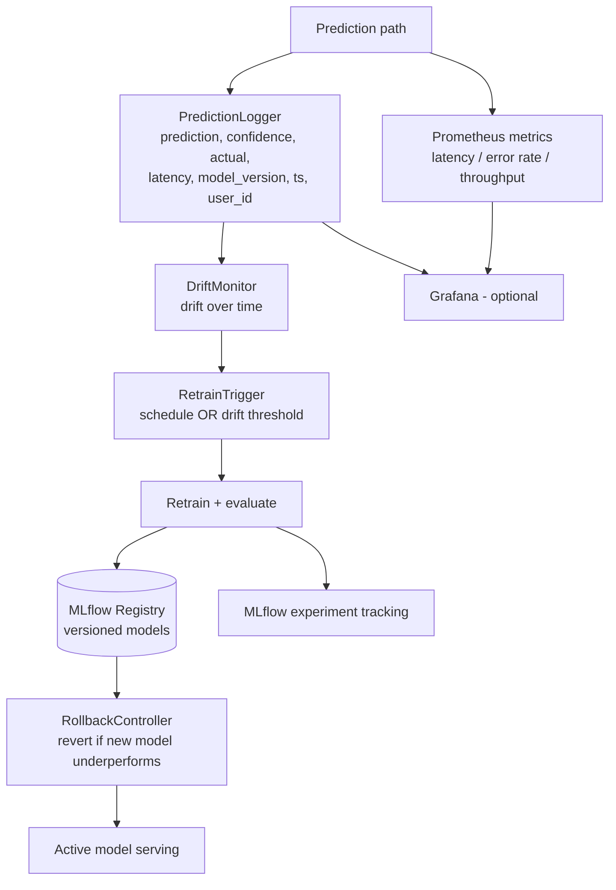
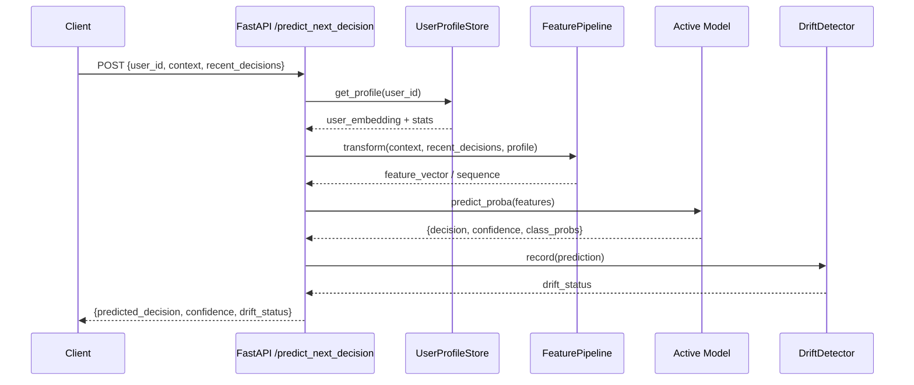
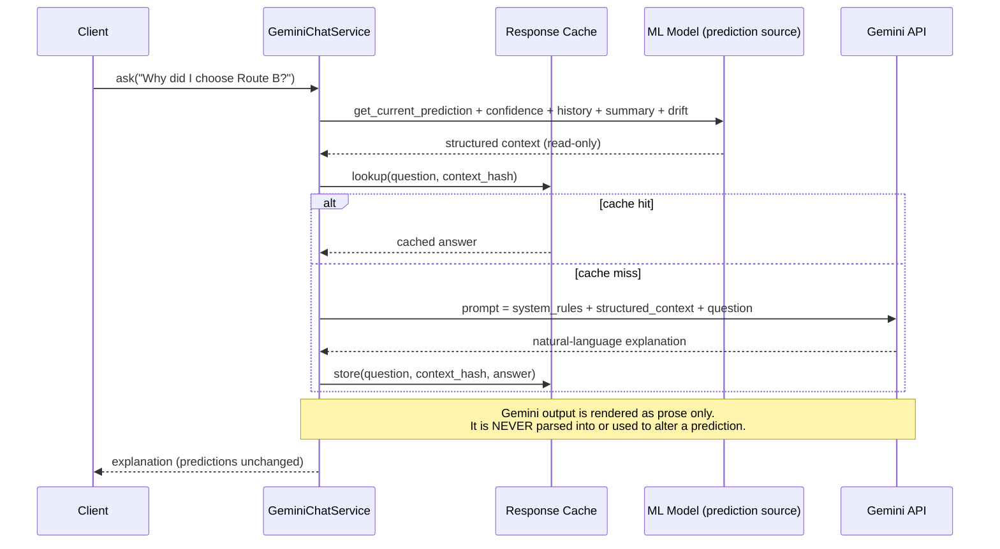

# Design Document: Behavioral Digital Twin

## Overview

The Behavioral Digital Twin is an AI system that learns an individual's decision-making
patterns from historical (initially synthetic) data and predicts their next likely
decision across three domains: route choice, productivity task choice, and consumer
purchase choice. The system produces both a predicted decision and a calibrated
confidence score, and it continuously adapts to each user as new decisions arrive.

The project is delivered as a proper, demoable repository with clear separation of
concerns: a configurable synthetic data layer, a deterministic feature engineering
pipeline, two competing model families (a gradient-boosting baseline and a sequence
model), a FastAPI prediction/retraining service with concept-drift detection, a
per-user personalization layer, two-plus end-to-end demo use cases, a Streamlit
dashboard, and an evaluation/ethics report.

The architecture is intentionally modular so the synthetic data generator can later be
swapped for a real data source without touching the modeling, serving, or UI layers.
All boundaries between layers are defined by stable interfaces and a shared, versioned
data schema.

### Expanded Scope

This design extends the original system along six additional, fully integrated axes while
preserving everything above. The original modules (generator, feature pipeline, baseline +
sequence models, evaluation, drift detection, personalization, demos, Streamlit dashboard)
remain intact; the additions slot in behind the same stable interfaces:

1. **Dual-mode data layer.** A single `DataSource` interface fronts two implementations —
   `SyntheticDataSource` (Mode 1 / Demo, wrapping the existing generator) and
   `RealDataSource` (Mode 2 / Production, one connector per real source behind the same
   contract). Feature and model code never learn which mode is active. A per-user mode
   flag and a migration/hand-off path let a user move from synthetic to real data as real
   data accumulates, and every stored decision row carries a `source_mode` column for
   downstream auditing.
2. **Phase 3 exact API response shapes.** New/aligned endpoints
   (`GET /predict_next_decision/{user_id}`, `GET /history/{user_id}`,
   `GET /drift_events/{user_id}`, `POST /retrain/{user_id}`) plus a consolidated
   frontend-facing response whose shape conforms exactly to the React contract. The
   existing internal predict/retrain logic is preserved and reconciled with these shapes
   via thin adapters.
3. **React full-motion dashboard.** A single-file React functional component (recharts +
   custom SVG/CSS, lucide-react, Tailwind, framer-motion with a CSS-keyframe fallback)
   becomes the primary UI deliverable. The Streamlit dashboard remains an optional internal
   tool. The React UI is bound by a hard 120fps motion budget and a sub-1.5s load sequence.
4. **Phase 4.5 Digital Twin chat.** A conversational layer using the Gemini API strictly
   for explanation/summarization/comparison. Gemini never produces or alters a prediction —
   the ML model remains the single source of predictions. Every Gemini prompt carries
   structured context (current prediction, confidence, recent history, behavior summary,
   drift score) and responses are cached per (question, context) pair.
5. **Phase 5 packaging.** Docker Compose to run API + frontend together, a README with an
   ASCII architecture diagram, setup steps, model results, and an ethics section, and a
   standardized repo layout (`/data`, `/models`, `/api`, `/frontend`, `/notebooks`).
6. **Phase 6 MLOps & production monitoring.** Model versioning + registry and experiment
   tracking (MLflow), a metrics dashboard (Prometheus, optional Grafana), complete
   prediction logging, drift monitoring tracked over time, automatic retraining triggers,
   API health checks, structured logging across the backend, performance monitoring
   (latency / error rate / throughput), and rollback to a previous model version when a new
   one underperforms.

## Architecture



### Repository Structure

```
behavioral-digital-twin/
├── data/
│   ├── synthetic_data_generator.py    # configurable synthetic decision generator
│   ├── decision_store.py              # CSV / SQLite persistence (+ source_mode column)
│   ├── schema.py                      # shared column schema + enums (+ source_mode)
│   ├── sources/                       # dual-mode data layer
│   │   ├── base.py                    # DataSource interface (mode-agnostic contract)
│   │   ├── synthetic_source.py        # SyntheticDataSource (Mode 1 / Demo)
│   │   ├── real_source.py             # RealDataSource (Mode 2 / Production) + registry
│   │   ├── mode_manager.py            # per-user mode flag, migration / hand-off
│   │   └── connectors/                # one connector per real source (same contract)
│   │       ├── base_connector.py      # SourceConnector interface
│   │       ├── user_interactions.py   # concrete
│   │       ├── route_selections.py    # concrete
│   │       ├── csv_import.py          # concrete
│   │       └── stubs.py               # study/productivity/calendar/github/browser/
│   │                                  #   weather/time/device stubs (same contract)
│   └── generated/                     # output datasets (gitignored)
├── features/
│   ├── feature_pipeline.py            # orchestrates feature construction
│   ├── temporal.py                    # hour, day-of-week, rolling frequency
│   ├── history.py                     # last-K decision sequence builder
│   └── encoders.py                    # categorical encoding / embeddings
├── models/
│   ├── base.py                        # DecisionModel interface
│   ├── baseline.py                    # gradient boosting / logistic regression
│   ├── sequence.py                    # LSTM / small Transformer
│   ├── evaluate.py                    # accuracy, F1, Brier, calibration
│   └── artifacts/                     # serialized models (gitignored)
├── personalization/
│   ├── profile_store.py               # per-user embedding/profile storage
│   └── updater.py                     # online profile update logic
├── api/
│   ├── main.py                        # FastAPI app + endpoints (Phase 3 shapes)
│   ├── drift.py                       # concept-drift detection
│   ├── schemas.py                     # pydantic request/response models
│   ├── response_adapters.py           # internal results -> exact frontend shapes
│   ├── chat.py                        # Phase 4.5 Gemini twin chat (explain-only)
│   └── health.py                      # health-check endpoints
├── mlops/                             # Phase 6 MLOps & production monitoring
│   ├── registry.py                    # MLflow model versioning + registry
│   ├── tracking.py                    # MLflow experiment tracking
│   ├── prediction_log.py              # complete per-prediction logging
│   ├── metrics.py                     # Prometheus exporters (latency/error/throughput)
│   ├── drift_monitor.py               # drift tracked over time in production
│   ├── retrain_trigger.py             # schedule / drift-threshold triggers
│   ├── rollback.py                    # underperformance rollback controller
│   └── logging_config.py              # structured logging (no print statements)
├── demos/
│   ├── route_demo.py
│   ├── productivity_demo.py
│   └── purchase_demo.py
├── dashboard/
│   └── app.py                         # optional internal Streamlit tool
├── frontend/                          # Phase 4 React full-motion dashboard (deliverable)
│   ├── src/
│   │   └── BehavioralTwinDashboard.tsx # single-file default-export component
│   ├── index.html
│   ├── package.json
│   └── tailwind.config.js
├── notebooks/
│   └── exploration.ipynb
├── tests/
├── docker-compose.yml                 # Phase 5: run API + frontend together
├── Dockerfile.api
├── Dockerfile.frontend
├── README.md                          # + ASCII architecture diagram + ethics
├── REPORT.md
└── requirements.txt
```

### Dual-Mode Data Layer (High-Level)



### Serving, Frontend & Chat (High-Level)



### MLOps & Production Monitoring (High-Level)



## Sequence Diagrams

### Prediction Flow



### Retrain + Personalization Flow

```mermaid
sequenceDiagram
    participant Client
    participant API as FastAPI /retrain
    participant Store as DecisionStore
    participant FE as FeaturePipeline
    participant Model as Model Trainer
    participant Prof as UserProfileStore

    Client->>API: POST /retrain {user_id?, since?}
    API->>Store: load_decisions(user_id, since)
    Store-->>API: decision_history
    API->>FE: fit_transform(history) [time-ordered]
    FE-->>API: train/val (time-based split)
    API->>Model: fit(train); evaluate(val)
    Model-->>API: metrics + new artifact
    API->>Prof: refresh_embedding(user_id, history)
    Prof-->>API: updated_profile
    API-->>Client: {status, metrics}
```

### Mode Hand-off Flow (Synthetic → Real)

```mermaid
sequenceDiagram
    participant Sched as Trigger (login / batch)
    participant Mode as ModeManager
    participant Real as RealDataSource
    participant Store as DecisionStore
    participant FE as FeaturePipeline

    Sched->>Mode: evaluate(user_id)
    Mode->>Real: count_real_records(user_id)
    Real-->>Mode: n_real
    alt n_real >= migration_threshold
        Mode->>Mode: set mode=real (or blend)
        Mode->>Real: fetch(user_id)
        Real-->>Mode: real records (source_mode="real")
        Mode->>Store: append(real records)
    else still warming up
        Mode->>Mode: keep mode=synthetic (or blend weight)
    end
    Note over FE: FeaturePipeline reads from DataSource only;<br/>it never learns which mode produced the rows.
```

### Twin Chat Flow (Phase 4.5 — Gemini explains, never predicts)



## Components and Interfaces

### Component 1: SyntheticDataGenerator

**Purpose**: Generate a realistic, configurable dataset of a fictional user's decisions
across three domains, with habits, weekday/weekend differences, gradual drift, and
occasional randomness.

**Interface**:
```python
class GeneratorConfig:
    n_days: int
    decisions_per_day: tuple[int, int]   # (min, max) per day
    domains: list[str]                   # ["route", "task", "purchase"]
    weekend_shift: float                 # 0..1 strength of weekend behavior change
    drift_rate: float                    # per-day probability of habit drift
    noise: float                         # 0..1 probability of random choice
    seed: int

class SyntheticDataGenerator:
    def __init__(self, config: GeneratorConfig) -> None: ...
    def generate(self) -> list[DecisionRecord]: ...
    def to_dataframe(self) -> "pandas.DataFrame": ...
```

**Responsibilities**:
- Produce time-ordered `DecisionRecord`s spanning `n_days`.
- Encode habit priors per domain that differ by `day_type` and `time_of_day`.
- Apply gradual drift and bounded random noise so patterns are learnable but imperfect.
- Remain deterministic for a fixed `seed`.

### Component 2: DecisionStore

**Purpose**: Persist and load decision records via CSV or SQLite behind one interface.

**Interface**:
```python
class DecisionStore:
    def __init__(self, backend: str, path: str) -> None: ...   # backend in {"csv","sqlite"}
    def append(self, records: list[DecisionRecord]) -> None: ...
    def load(self, user_id: str | None = None,
             since: "datetime | None" = None) -> list[DecisionRecord]: ...
    def count(self, user_id: str | None = None) -> int: ...
```

**Responsibilities**:
- Provide a stable persistence boundary so synthetic data can be swapped for real data.
- Return records sorted by timestamp ascending.

### Component 3: FeaturePipeline

**Purpose**: Transform raw decision records into model-ready features deterministically.

**Interface**:
```python
class FeaturePipeline:
    def fit(self, records: list[DecisionRecord]) -> "FeaturePipeline": ...
    def transform(self, records: list[DecisionRecord]) -> FeatureMatrix: ...
    def transform_one(self, context: Context,
                      recent: list[DecisionRecord],
                      profile: UserProfile) -> FeatureVector: ...
    def history_dim: int
    def k: int                               # history window length
```

**Responsibilities**:
- Build temporal features (hour, day-of-week, rolling frequency).
- Build last-K decision sequence (behavioral history).
- Encode categorical context features consistently between fit and transform.

### Component 4: DecisionModel (Baseline + Sequence)

**Purpose**: Predict the next decision and a calibrated confidence per domain.

**Interface**:
```python
class DecisionModel:                          # abstract
    def fit(self, X: FeatureMatrix, y: Labels) -> None: ...
    def predict(self, x: FeatureVector) -> str: ...
    def predict_proba(self, x: FeatureVector) -> dict[str, float]: ...
    def save(self, path: str) -> None: ...
    @classmethod
    def load(cls, path: str) -> "DecisionModel": ...

class BaselineModel(DecisionModel): ...        # GradientBoosting / LogisticRegression
class SequenceModel(DecisionModel): ...        # LSTM / small Transformer
```

**Responsibilities**:
- `BaselineModel` consumes flat feature vectors.
- `SequenceModel` consumes the last-K sequence plus context and user embedding.
- Both expose probabilities for calibration (Brier) and confidence reporting.

### Component 5: UserProfileStore + ProfileUpdater (Personalization)

**Purpose**: Maintain a per-user embedding/profile that updates as new decisions arrive.

**Interface**:
```python
class UserProfile:
    user_id: str
    embedding: list[float]                   # learned/aggregated behavioral vector
    decision_counts: dict[str, int]          # per domain/class frequencies
    last_updated: "datetime"

class UserProfileStore:
    def get(self, user_id: str) -> UserProfile: ...
    def upsert(self, profile: UserProfile) -> None: ...

class ProfileUpdater:
    def update(self, profile: UserProfile,
               new_records: list[DecisionRecord]) -> UserProfile: ...
```

**Responsibilities**:
- Provide a current profile to the prediction path.
- Apply an online (incremental) update so the twin adapts without full retraining.

### Component 6: DriftDetector

**Purpose**: Flag when observed behavior diverges from twin predictions (concept drift).

**Interface**:
```python
class DriftDetector:
    def __init__(self, window: int, threshold: float) -> None: ...
    def record(self, predicted: str, actual: str | None, confidence: float) -> None: ...
    def status(self) -> DriftStatus: ...      # {drift: bool, score: float, window_acc: float}
```

**Responsibilities**:
- Track rolling prediction accuracy / confidence.
- Raise a drift flag when rolling accuracy falls below `threshold`.

### Component 7: FastAPI Prediction Engine

**Purpose**: Serve predictions, profiles, and retraining; expose drift status.

**Endpoints**:
- `POST /predict_next_decision` → `{predicted_decision, confidence, class_probs, drift_status}`
- `GET /user_profile/{id}` → `{user_id, decision_counts, embedding_summary, last_updated}`
- `POST /retrain` → `{status, metrics}`

### Component 8: DataSource (Dual-Mode Data Layer)

**Purpose**: Provide one mode-agnostic contract for obtaining decision records, with a
synthetic (Mode 1) and a real (Mode 2) implementation, so feature/model code never knows
which mode produced the data.

**Interface**:
```python
class SourceMode(str, Enum):
    SYNTHETIC = "synthetic"
    REAL = "real"

class DataSource:                                  # abstract, mode-agnostic
    mode: SourceMode
    def fetch(self, user_id: str,
              since: "datetime | None" = None) -> list[DecisionRecord]: ...
    def count(self, user_id: str) -> int: ...

class SyntheticDataSource(DataSource):             # Mode 1 / Demo
    def __init__(self, generator: SyntheticDataGenerator) -> None: ...
    # wraps the existing generator; tags every record source_mode="synthetic"

class RealDataSource(DataSource):                  # Mode 2 / Production
    def __init__(self, connectors: list["SourceConnector"]) -> None: ...
    # merges connector output (time-ordered); tags every record source_mode="real"

class SourceConnector:                             # one per real source, same contract
    name: str
    enabled: bool
    def pull(self, user_id: str,
             since: "datetime | None" = None) -> list[DecisionRecord]: ...
```

**Concrete connectors (start now)**: `UserInteractionsConnector`, `RouteSelectionsConnector`,
`CsvImportConnector`.
**Stubbed connectors (same contract, fillable later without breaking it)**:
`StudySessionsConnector`, `ProductivityLogsConnector`, `CalendarConnector`,
`GitHubActivityConnector`, `BrowserActivityConnector` (opt-in only),
`WeatherConnector`, `TimeConnector`, `DeviceConnector`. Each stub returns an empty,
well-formed result and declares `enabled = False` until implemented.

**Responsibilities**:
- Expose identical `fetch`/`count` semantics regardless of mode.
- Stamp `source_mode` on every emitted record for downstream auditing.
- Keep the synthetic path delegating to the existing generator unchanged.

### Component 9: ModeManager (Per-User Mode Flag + Migration)

**Purpose**: Hold each user's mode flag/config and govern the synthetic→real hand-off as
real data accumulates (blend or hand off per user).

**Interface**:
```python
class ModeConfig:
    user_id: str
    mode: SourceMode                  # active mode for this user
    blend_weight: float               # 0..1 share of real data during blend
    migration_threshold: int          # real-record count to fully hand off

class ModeManager:
    def __init__(self, synthetic: SyntheticDataSource,
                 real: RealDataSource, store: "ModeConfigStore") -> None: ...
    def get_mode(self, user_id: str) -> ModeConfig: ...
    def resolve_source(self, user_id: str) -> DataSource: ...   # returns active source
    def evaluate_migration(self, user_id: str) -> ModeConfig: ...  # may flip/blend
```

**Responsibilities**:
- Default new users to synthetic (Mode 1).
- Promote a user to real (Mode 2) once `count_real >= migration_threshold`, or blend.
- Never expose mode choice to feature/model layers — they consume `resolve_source(...)`.

### Component 10: ResponseAdapter (Phase 3 Exact Shapes)

**Purpose**: Reconcile the existing internal predict/retrain/drift results into the exact
consolidated shape the React frontend consumes, without changing the internal logic.

**Interface**:
```python
class ResponseAdapter:
    @staticmethod
    def predict_next(user_id: str) -> dict: ...    # predicted decision + confidence
    @staticmethod
    def history(user_id: str) -> list[dict]: ...   # predicted vs actual
    @staticmethod
    def drift_events(user_id: str) -> list[dict]: ...
    @staticmethod
    def dashboard(user_id: str) -> dict: ...        # consolidated exact shape (see Data Models)
```

**Responsibilities**:
- Map internal `PredictionResult`, store history, and `DriftDetector`/`DriftMonitor`
  output onto the exact field names/types the frontend expects.
- Guarantee response-shape conformance (validated by a pydantic response model).

### Component 11: GeminiChatService (Phase 4.5 Twin Chat)

**Purpose**: Provide conversational explanation/summarization/comparison using Gemini,
strictly separated from prediction.

**Interface**:
```python
class ChatContext:
    user_id: str
    current_prediction: str
    confidence: float
    recent_history: list[DecisionRecord]
    behavior_summary: dict
    drift_score: float

class GeminiChatService:
    def __init__(self, api_key_env: str = "GEMINI_API_KEY",
                 cache: "ChatCache | None" = None) -> None: ...
    def build_context(self, user_id: str) -> ChatContext: ...   # reads ML outputs read-only
    def ask(self, user_id: str, question: str) -> str: ...      # returns prose only
```

**Responsibilities**:
- Read the ML model's current prediction/confidence/history/summary/drift as **read-only**
  structured context and embed it in every prompt.
- Use Gemini **only** for conversation; never parse its output into a prediction or mutate
  any prediction, model, or stored decision.
- Cache answers per `(question, context_hash)`; read the key from an env var/secret.

### Component 12: MLOps Platform (Phase 6)

**Purpose**: Versioning, tracking, logging, monitoring, automatic retraining, and rollback
for production operation.

**Interface**:
```python
class ModelRegistry:                       # MLflow-backed
    def register(self, domain: str, artifact_path: str,
                 metrics: dict) -> "ModelVersion": ...
    def active(self, domain: str) -> "ModelVersion": ...
    def promote(self, version: "ModelVersion") -> None: ...
    def previous(self, domain: str) -> "ModelVersion | None": ...

class PredictionLogger:
    def log(self, *, user_id: str, domain: str, prediction: str,
            confidence: float, model_version: str, latency_ms: float,
            timestamp: "datetime") -> str: ...               # returns log_id
    def attach_actual(self, log_id: str, actual: str) -> None: ...  # once known

class DriftMonitor:                          # drift over time in production
    def append(self, user_id: str, domain: str,
               window_acc: float, drift: bool, timestamp: "datetime") -> None: ...
    def series(self, user_id: str, domain: str) -> list[dict]: ...

class RetrainTrigger:
    def should_retrain(self, domain: str) -> bool: ...   # schedule OR drift threshold

class RollbackController:
    def evaluate(self, domain: str, candidate: "ModelVersion",
                 baseline: "ModelVersion") -> bool: ...   # True => keep candidate
    def rollback(self, domain: str) -> "ModelVersion": ...  # restore previous
```

**Responsibilities**:
- Register every trained model with a version + metrics (MLflow registry + tracking).
- Log every prediction with prediction, confidence, actual-once-known, latency,
  model version, timestamp, and user id.
- Track drift over time, fire schedule/threshold-based retrains, expose Prometheus metrics
  and `/health` checks, use structured logging (no `print`), and roll back to the previous
  version when a candidate underperforms.

### Component 13: React Full-Motion Dashboard (Phase 4)

**Purpose**: Primary UI deliverable — a single-file React functional component visualizing
the twin with a 120fps motion budget.

**Interface (component contract)**:
```tsx
// frontend/src/BehavioralTwinDashboard.tsx
export default function BehavioralTwinDashboard(): JSX.Element
// - Fetches the consolidated Phase 3 shape from the API base URL.
// - Falls back to MOCK_DATA (same shape) when the API is unreachable.
// - Sections: Header (twin status, lastSynced, accuracy vital sign),
//   The Mirror (hero real-vs-predicted time series + confidence band),
//   Decision Timeline (predicted vs actual hit/miss), Drift Alerts Panel.
```

**Responsibilities**:
- Render the four sections from the exact response shape.
- Honor the motion budget: animate only `transform`/`opacity`, animate SVG path
  `stroke-dashoffset` from a precomputed path length, heartbeat as a pure CSS keyframe,
  JS motion via `requestAnimationFrame`, `will-change` on only the 2–3 continuously
  animating elements, memoize static parts, respect `prefers-reduced-motion`.
- No `localStorage`; responsive; load sequence under ~1.5s.

## Data Models

### Model 1: DecisionRecord

```python
class DecisionRecord:
    user_id: str
    timestamp: datetime
    domain: str                # "route" | "task" | "purchase"
    location: str              # categorical context
    weather: str               # categorical context
    day_type: str              # "weekday" | "weekend"
    time_of_day: str           # "morning"|"afternoon"|"evening"|"night"
    mood_energy: float         # 0..1 proxy for mood/energy
    decision_made: str         # chosen option (domain-specific)
    outcome: str               # realized outcome label
    source_mode: str           # "synthetic" | "real"  (audit which mode produced the row)
```

**Validation Rules**:
- `domain` ∈ {route, task, purchase}; `decision_made` must belong to that domain's option set.
- `mood_energy` ∈ [0, 1].
- `time_of_day` derived consistently from `timestamp.hour`.
- `day_type` derived consistently from `timestamp.weekday()`.
- `source_mode` ∈ {synthetic, real}; defaults to `synthetic` for backward compatibility so
  existing rows/readers remain valid (additive, schema version bumped).

### Model 2: Context (prediction-time input)

```python
class Context:
    location: str
    weather: str
    day_type: str
    time_of_day: str
    mood_energy: float
    domain: str
```

**Validation Rules**:
- All categorical fields must be values seen during `FeaturePipeline.fit` or mapped to an
  explicit `"<UNK>"` bucket.
- `domain` selects which model/label space is used.

### Model 3: FeatureVector / FeatureMatrix

```python
class FeatureVector:
    temporal: list[float]      # [hour_sin, hour_cos, dow_onehot..., rolling_freq...]
    context: list[float]       # encoded categorical context
    history: list[int]         # last-K decision class ids (padded)
    user_embedding: list[float]
```

**Validation Rules**:
- `history` length == `k` (left-padded with a `PAD` id).
- All sub-vectors have fixed, schema-versioned dimensions.

### Model 4: PredictionResult

```python
class PredictionResult:
    predicted_decision: str
    confidence: float          # max class probability, calibrated
    class_probs: dict[str, float]
    model_name: str            # "baseline" | "sequence"
    drift_status: DriftStatus
```

**Validation Rules**:
- `sum(class_probs.values())` ≈ 1.0.
- `confidence` == `max(class_probs.values())`.

### Model 5: Consolidated Dashboard Response (Phase 3 — EXACT shape)

This is the exact, frozen shape the React frontend consumes. The `ResponseAdapter` and a
pydantic response model guarantee conformance; field names, types, and nesting must match
exactly.

```jsonc
{
  "accuracy": 0.82,                              // float, overall hit rate
  "lastSynced": "2026-06-22T09:14:00Z",          // ISO-8601 UTC string
  "timeline": [                                  // hero "Mirror" series
    { "date": "2026-05-23", "actual": 1, "predicted": 0.9, "confidence": 0.91 }
  ],
  "decisions": [                                 // decision timeline (hit/miss)
    { "id": 1, "timestamp": "...", "domain": "route",
      "predicted": "Route B", "actual": "Route B", "hit": true, "confidence": 0.88 }
  ],
  "driftEvents": [                               // drift alerts panel
    { "date": "2026-06-10", "domain": "route",
      "note": "Route predictions became less reliable on weekends." }
  ]
}
```

**Per-endpoint shapes** (reconciled from existing internal logic):
- `GET /predict_next_decision/{user_id}` → `{ "predicted": str, "confidence": float }`
  (derived from internal `PredictionResult`).
- `GET /history/{user_id}` → the `decisions` array above (predicted vs actual).
- `GET /drift_events/{user_id}` → the `driftEvents` array above.
- `POST /retrain/{user_id}` → `{ "status": str, "metrics": {...} }` (existing retrain logic).

**Validation Rules**:
- `accuracy` ∈ [0, 1]; `lastSynced` parses as ISO-8601.
- For every `decisions[i]`: `hit == (predicted == actual)` and `confidence` ∈ [0, 1].
- `timeline[i].actual` ∈ {0, 1}; `timeline[i].predicted`, `confidence` ∈ [0, 1].

### Model 6: ChatContext (Phase 4.5)

```python
class ChatContext:
    user_id: str
    current_prediction: str        # from the ML model (read-only)
    confidence: float              # from the ML model (read-only)
    recent_history: list[DecisionRecord]
    behavior_summary: dict         # aggregates (counts, trends)
    drift_score: float             # current drift score
```

**Validation Rules**:
- All fields are sourced from ML/store outputs; the chat layer treats them as read-only.
- `confidence`, `drift_score` ∈ [0, 1]. The struct must be fully populated before any
  Gemini call (no Gemini call without prediction context).

### Model 7: PredictionLogEntry (Phase 6)

```python
class PredictionLogEntry:
    log_id: str
    user_id: str
    domain: str
    prediction: str
    confidence: float
    actual: str | None             # filled in once the true decision is known
    latency_ms: float
    model_version: str
    timestamp: datetime
```

**Validation Rules**:
- Every served prediction produces exactly one entry (completeness).
- `actual` starts `None` and is set at most once via `attach_actual`.
- `model_version` references a registered model version.

### Model 8: ModelVersion (Phase 6)

```python
class ModelVersion:
    domain: str
    version: str                   # monotonic / MLflow run id
    artifact_path: str
    metrics: dict                  # accuracy, macro_f1, brier at registration
    created_at: datetime
    status: str                    # "staging" | "active" | "archived"
```

**Validation Rules**:
- Exactly one `active` version per domain at any time.
- Rollback restores the most recent non-active prior version and marks it `active`.

## Algorithmic Pseudocode

### Synthetic Data Generation

```python
def generate(config) -> list[DecisionRecord]:
    """
    Preconditions:
      - config.n_days > 0
      - 0 <= config.weekend_shift, config.drift_rate, config.noise <= 1
      - config.domains is non-empty subset of {route, task, purchase}
    Postconditions:
      - returns records sorted ascending by timestamp
      - every record passes DecisionRecord validation
      - identical output for identical config.seed (determinism)
    """
    rng = seeded_rng(config.seed)
    habits = init_habit_priors(config.domains, rng)   # per (domain, day_type, time_of_day)
    records = []
    for day in range(config.n_days):
        date = start_date + day
        day_type = "weekend" if is_weekend(date) else "weekday"
        habits = apply_drift(habits, config.drift_rate, rng)   # gradual drift
        n = rng.randint(config.decisions_per_day)
        # Loop invariant: records remains time-ordered after each append
        for _ in range(n):
            ts = sample_timestamp(date, rng)
            tod = time_of_day(ts)
            for domain in config.domains:
                ctx = sample_context(domain, day_type, tod, rng)
                if rng.random() < config.noise:
                    choice = rng.choice(options(domain))        # occasional randomness
                else:
                    choice = sample_from_prior(habits, domain,
                                               day_type, tod, ctx, config.weekend_shift)
                outcome = realize_outcome(domain, choice, ctx, rng)
                records.append(DecisionRecord(... ts, domain, ctx, choice, outcome ...))
    return sort_by_timestamp(records)
```

### Feature Construction

```python
def transform(records) -> FeatureMatrix:
    """
    Preconditions:
      - pipeline has been fit (encoders + history length k known)
      - records sorted ascending by timestamp
    Postconditions:
      - returns one FeatureVector per record (after the first k warmup records per user)
      - history[i] uses only decisions strictly before record i (no future leakage)
    Loop invariant:
      - 'window' holds the most recent k decision class ids prior to current record
    """
    out = []
    window = deque(maxlen=k)
    freq = RollingFrequencyTracker()
    for r in records:
        temporal = [hour_sin(r), hour_cos(r), *dow_onehot(r), *freq.features(r)]
        context  = encode_context(r)                 # consistent with fit()
        history  = left_pad(list(window), k, PAD)
        emb      = profile_store.get(r.user_id).embedding
        out.append(FeatureVector(temporal, context, history, emb))
        window.append(class_id(r.decision_made))     # update AFTER building features
        freq.update(r)
    return FeatureMatrix(out)
```

### Time-Based Train/Eval Split + Comparison

```python
def evaluate_models(records) -> ComparisonReport:
    """
    Preconditions:
      - len(records) sufficient for a non-empty train and val partition
    Postconditions:
      - split is strictly temporal: all train timestamps < all val timestamps
      - report contains accuracy, macro-F1, and Brier for baseline and sequence
    """
    train, val = time_based_split(records, val_fraction=0.2)   # no shuffling
    pipe = FeaturePipeline().fit(train)
    Xtr, ytr = pipe.transform(train).Xy()
    Xva, yva = pipe.transform(val).Xy()

    baseline = BaselineModel().fit(Xtr, ytr)
    sequence = SequenceModel().fit(Xtr, ytr)

    return ComparisonReport(
        baseline = score(baseline, Xva, yva),     # acc, macro_f1, brier
        sequence = score(sequence, Xva, yva),
    )
```

### Online Profile Update (Personalization)

```python
def update(profile, new_records) -> UserProfile:
    """
    Preconditions:
      - new_records belong to profile.user_id and are newer than profile.last_updated
      - 0 < learning_rate <= 1
    Postconditions:
      - decision_counts incremented by occurrences in new_records
      - embedding moved toward the mean behavior of new_records (EMA)
      - last_updated == max(timestamp in new_records)
    """
    for r in new_records:
        profile.decision_counts[r.decision_made] += 1
    target = aggregate_behavior_vector(new_records)
    profile.embedding = ema(profile.embedding, target, learning_rate)   # (1-a)*old + a*target
    profile.last_updated = max(r.timestamp for r in new_records)
    return profile
```

### Concept-Drift Detection

```python
def status(detector) -> DriftStatus:
    """
    Preconditions:
      - detector.window > 0, 0 <= threshold <= 1
    Postconditions:
      - window_acc = correct / observed over the last `window` labeled predictions
      - drift == True  iff  observed >= window AND window_acc < threshold
    """
    observed = len(detector.recent_labeled)
    if observed == 0:
        return DriftStatus(drift=False, score=0.0, window_acc=None)
    window_acc = mean(1 if p == a else 0 for (p, a) in detector.recent_labeled)
    drift = observed >= detector.window and window_acc < detector.threshold
    return DriftStatus(drift=drift, score=1.0 - window_acc, window_acc=window_acc)
```

### Dual-Mode Source Resolution + Migration

```python
def resolve_source(mode_manager, user_id) -> DataSource:
    """
    Preconditions:
      - user_id is known to ModeConfigStore (else a synthetic default is created)
    Postconditions:
      - returns SyntheticDataSource if active mode == synthetic
      - returns RealDataSource if active mode == real
      - the returned object satisfies the SAME DataSource contract (mode-agnostic)
      - feature/model callers cannot observe which concrete type was returned
    """
    cfg = mode_manager.get_mode(user_id)          # defaults to synthetic for new users
    if cfg.mode == SourceMode.REAL:
        return mode_manager.real
    return mode_manager.synthetic


def evaluate_migration(mode_manager, user_id) -> ModeConfig:
    """
    Preconditions:
      - cfg.migration_threshold > 0 ; 0 <= cfg.blend_weight <= 1
    Postconditions:
      - mode flips synthetic -> real once real-record count >= migration_threshold
      - mode never regresses real -> synthetic (hand-off is monotonic)
      - when blending, blend_weight is non-decreasing toward 1.0 as real data grows
      - emitted records carry source_mode matching their true origin
    """
    cfg = mode_manager.get_mode(user_id)
    n_real = mode_manager.real.count(user_id)
    if cfg.mode == SourceMode.SYNTHETIC and n_real >= cfg.migration_threshold:
        cfg.mode = SourceMode.REAL                # hand off
    elif cfg.mode == SourceMode.SYNTHETIC:
        cfg.blend_weight = min(1.0, n_real / cfg.migration_threshold)   # blend ramp
    mode_manager.store.upsert(cfg)
    return cfg
```

### Phase 3 Consolidated Response Assembly

```python
def dashboard(user_id) -> dict:
    """
    Preconditions:
      - a trained model artifact exists for at least one requested domain
    Postconditions:
      - returns the EXACT consolidated shape (Model 5): keys
        {accuracy, lastSynced, timeline, decisions, driftEvents}
      - for every decisions[i]: hit == (predicted == actual)
      - accuracy == mean(1 if d.hit else 0 for d in decisions) when decisions non-empty
      - internal predict/retrain logic is reused unchanged; this only re-shapes outputs
    """
    history = store.load(user_id)                          # internal records
    decisions = []
    for i, r in enumerate(history_with_predictions(history)):
        decisions.append({
            "id": i + 1, "timestamp": r.timestamp.isoformat(),
            "domain": r.domain, "predicted": label(r.predicted),
            "actual": label(r.actual), "hit": r.predicted == r.actual,
            "confidence": r.confidence,
        })
    timeline = [
        {"date": d["timestamp"][:10], "actual": 1 if d["hit"] else 0,
         "predicted": d["confidence"] if d["hit"] else 1 - d["confidence"],
         "confidence": d["confidence"]}
        for d in decisions
    ]
    drift_events = [
        {"date": e.date.isoformat()[:10], "domain": e.domain, "note": e.note}
        for e in drift_monitor.events(user_id)
    ]
    acc = mean(1 if d["hit"] else 0 for d in decisions) if decisions else 0.0
    return {"accuracy": acc, "lastSynced": now_utc_iso(),
            "timeline": timeline, "decisions": decisions, "driftEvents": drift_events}
```

### Gemini Twin Chat (Explain-Only, Cached)

```python
def ask(chat, user_id, question) -> str:
    """
    Preconditions:
      - GEMINI_API_KEY is available via env/secret (never hardcoded)
      - the ML model can produce a current prediction + confidence for user_id
    Postconditions:
      - returns natural-language prose ONLY
      - the active prediction, model, and stored decisions are unchanged (no mutation)
      - Gemini output is never parsed into or used to derive a prediction
      - identical (question, context) pairs return a cached answer (idempotent)
    """
    ctx = chat.build_context(user_id)              # read-only ML/store outputs
    assert ctx.current_prediction is not None      # no chat without prediction context
    key = hash((question, context_hash(ctx)))
    if chat.cache.has(key):
        return chat.cache.get(key)
    prompt = compose_prompt(
        system_rules="You explain; you must not predict or change predictions.",
        context=ctx,                               # prediction, confidence, history,
        question=question,                         #   behavior_summary, drift_score
    )
    answer = gemini_generate(prompt, api_key=env("GEMINI_API_KEY"))
    chat.cache.set(key, answer)
    return answer                                  # rendered as prose, not as a prediction
```

### Prediction Logging + Drift-Over-Time (Phase 6)

```python
def serve_and_log(predictor, logger, drift_monitor, request) -> PredictionResult:
    """
    Preconditions:
      - an active model version exists for request.domain
    Postconditions:
      - exactly one PredictionLogEntry is written per served prediction (completeness)
      - the entry records prediction, confidence, latency, model_version, timestamp, user_id
      - actual is left None until attach_actual is called once the true decision is known
      - drift_monitor.series(user_id, domain) grows by exactly one point per status update
        (append-only; existing points are never mutated -> monotonic logging over time)
    """
    t0 = clock()
    result = predictor.predict(request)            # existing internal logic, unchanged
    latency = clock() - t0
    log_id = logger.log(user_id=request.user_id, domain=request.domain,
                        prediction=result.predicted_decision, confidence=result.confidence,
                        model_version=registry.active(request.domain).version,
                        latency_ms=latency, timestamp=now())
    status = drift_detector.status()
    drift_monitor.append(request.user_id, request.domain,
                         window_acc=status.window_acc or 0.0,
                         drift=status.drift, timestamp=now())   # append-only point
    metrics.observe(latency=latency, domain=request.domain)     # Prometheus
    return result
```

### Automatic Retrain Trigger + Rollback Safety (Phase 6)

```python
def maybe_retrain_and_promote(domain) -> ModelVersion:
    """
    Preconditions:
      - a baseline (currently active) model version exists for domain
    Postconditions:
      - retrain fires iff schedule is due OR production drift exceeds threshold
      - a candidate is promoted ONLY if it does not underperform the baseline
        on the agreed metric(s); otherwise the baseline remains active (rollback safety)
      - exactly one active version per domain at all times
    """
    if not retrain_trigger.should_retrain(domain):   # schedule OR drift threshold
        return registry.active(domain)
    baseline = registry.active(domain)
    candidate = train_and_register(domain)           # MLflow tracking + registry
    if rollback_controller.evaluate(domain, candidate, baseline):
        registry.promote(candidate)                  # candidate >= baseline
        return candidate
    registry.promote(baseline)                       # keep/rollback to baseline
    return baseline
```


## Key Functions with Formal Specifications

### Function: predict_next_decision(user_id, context, recent)

```python
def predict_next_decision(user_id, context, recent) -> PredictionResult
```

**Preconditions**:
- `context.domain` is a supported domain with a trained model loaded.
- `recent` is time-ordered and may be empty (cold start handled by padding).

**Postconditions**:
- Returns a `PredictionResult` whose `class_probs` form a valid distribution summing to ~1.
- `predicted_decision` belongs to the domain's option set.
- `confidence == max(class_probs.values())`.
- No mutation of input `recent` or `context`.

**Loop Invariants**: N/A (single forward pass; feature build invariants covered above).

### Function: time_based_split(records, val_fraction)

```python
def time_based_split(records, val_fraction) -> tuple[list, list]
```

**Preconditions**:
- `records` non-empty and sorted ascending by timestamp; `0 < val_fraction < 1`.

**Postconditions**:
- `max(timestamp in train) <= min(timestamp in val)` (no temporal leakage).
- `train + val` is a partition of `records` (no loss, no duplication).

**Loop Invariants**: N/A.

### Function: ResponseAdapter.dashboard(user_id)

```python
def dashboard(user_id: str) -> dict
```

**Preconditions**:
- At least one requested domain has a trained, registered model.

**Postconditions**:
- Returns the exact Model 5 shape (`accuracy`, `lastSynced`, `timeline`, `decisions`,
  `driftEvents`) and passes pydantic response-model validation.
- For each `decisions[i]`: `hit == (predicted == actual)`.
- No mutation of stored records; internal predict/retrain logic is reused unchanged.

**Loop Invariants**: building `decisions` preserves ascending timestamp order.

### Function: GeminiChatService.ask(user_id, question)

```python
def ask(user_id: str, question: str) -> str
```

**Preconditions**:
- `GEMINI_API_KEY` is present in the environment/secret store.
- The ML model can supply a current prediction + confidence for `user_id`.

**Postconditions**:
- Returns prose only; the active prediction, model artifacts, and stored decisions are
  unchanged.
- Output is never parsed into or used to alter a prediction.
- Identical `(question, context)` pairs return the cached answer.

**Loop Invariants**: N/A.

### Function: maybe_retrain_and_promote(domain)

```python
def maybe_retrain_and_promote(domain: str) -> ModelVersion
```

**Preconditions**:
- A currently active (baseline) model version exists for `domain`.

**Postconditions**:
- Retrains iff schedule is due or production drift exceeds threshold.
- A candidate becomes active only if it does not underperform the baseline; otherwise the
  baseline remains active.
- Exactly one active version per domain after the call.

**Loop Invariants**: N/A.

### React Motion Budget (120fps) — Implementation Rules

The frontend component is not "code-light"; it has hard, testable performance rules:

```text
ANIMATION RULES (frontend/src/BehavioralTwinDashboard.tsx)
  - Animate ONLY transform and opacity (never layout-affecting properties).
  - The Mirror line "draws" by animating SVG stroke-dashoffset:
      pathLength <- ref.getTotalLength()           // precompute once on mount
      stroke-dasharray = pathLength
      stroke-dashoffset: pathLength -> 0 via CSS transition (GPU-composited).
  - Heartbeat / accuracy "vital sign" pulse is a PURE CSS @keyframes animation
    (transform: scale + opacity) — NO setInterval / no state-driven loop.
  - Any JS-driven motion uses requestAnimationFrame, never setInterval.
  - will-change is set on ONLY the 2-3 continuously animating elements.
  - Static sections are memoized (React.memo / useMemo) so they never re-render
    during animation frames.
  - Respect prefers-reduced-motion: reduce -> disable non-essential motion.
  - Data fetch: single request to the Phase 3 API; on failure use MOCK_DATA
    (identical shape to Model 5). No localStorage. Responsive layout.
  - Target: interactive load sequence under ~1.5s.
```

## Example Usage

```python
# 1. Generate synthetic data
from data.synthetic_data_generator import SyntheticDataGenerator, GeneratorConfig
from data.decision_store import DecisionStore

cfg = GeneratorConfig(n_days=180, decisions_per_day=(2, 5),
                      domains=["route", "task", "purchase"],
                      weekend_shift=0.6, drift_rate=0.02, noise=0.1, seed=42)
records = SyntheticDataGenerator(cfg).generate()
DecisionStore("sqlite", "data/generated/decisions.db").append(records)

# 2. Build features + compare models (time-based split)
from models.evaluate import evaluate_models
report = evaluate_models(records)
print(report.baseline, report.sequence)   # acc, macro_f1, brier

# 3. Serve predictions
#    uvicorn api.main:app --reload
#    POST /predict_next_decision
#      {"user_id": "u1",
#       "context": {"domain": "route", "location": "home", "weather": "rain",
#                   "day_type": "weekday", "time_of_day": "morning", "mood_energy": 0.7},
#       "recent_decisions": ["route_B", "route_A", "route_A"]}
#    -> {"predicted_decision": "route_A", "confidence": 0.81, "drift_status": {...}}
```

## Correctness Properties

*A property is a characteristic or behavior that should hold true across all valid
executions of a system-essentially, a formal statement about what the system should do.
Properties serve as the bridge between human-readable specifications and machine-verifiable
correctness guarantees.*

### Property 1: Generator determinism
*For any* fixed `GeneratorConfig` (including `seed`), `generate()` produces an identical
record sequence on repeated runs.

**Validates: Requirements 1.3**

### Property 2: Schema validity
*For any* generated or stored `DecisionRecord`, all `DecisionRecord` validation rules hold:
`domain` is valid, `decision_made` belongs to the domain option set, `mood_energy` is in
[0, 1], and `time_of_day` and `day_type` are consistently derived from the timestamp.

**Validates: Requirements 2.1, 2.2, 2.3, 2.4, 2.5**

### Property 3: Temporal ordering
*For any* set of generated records and any insertion order, `DecisionStore.load()` returns
records sorted ascending by timestamp.

**Validates: Requirements 1.2, 3.3**

### Property 4: No future leakage
*For any* record stream and every feature vector at index i, the `history` and rolling
frequency components depend only on records strictly earlier than record i.

**Validates: Requirements 4.3, 4.4**

### Property 5: Probability validity
*For any* prediction from either model, `class_probs` is a valid distribution (non-negative,
sums to ~1), `confidence == max(class_probs)`, and `predicted_decision` is a member of the
domain's option set.

**Validates: Requirements 5.3, 5.4, 7.2, 7.3**

### Property 6: Temporal split integrity
*For any* sorted record set and valid `val_fraction`, `time_based_split` yields a partition
of the input (no loss, no duplication) where every train timestamp ≤ every val timestamp.

**Validates: Requirements 6.1, 6.2**

### Property 7: Profile monotonicity
*For any* update via `ProfileUpdater.update`, each decision count is ≥ its prior value and
`last_updated` is non-decreasing (equal to the maximum timestamp among the new records).

**Validates: Requirements 11.2, 11.4**

### Property 8: Drift flag soundness
*For any* sequence of labeled predictions, `DriftStatus.drift` is True if and only if at
least `window` labeled predictions exist and rolling accuracy < threshold.

**Validates: Requirements 10.3, 10.4**

### Property 9: DataSource mode-agnosticism
*For any* user and any active mode, `SyntheticDataSource` and `RealDataSource` satisfy the
same `DataSource` contract: `fetch`/`count` return well-formed, schema-valid,
timestamp-ascending records, and the feature/model layers produce the same shapes
regardless of which concrete source was resolved. No downstream code branches on mode.

**Validates: Requirements 13.1**

### Property 10: source_mode audit integrity
*For any* stored decision row, `source_mode` ∈ {synthetic, real} and equals the mode of the
source that produced it; synthetic rows are never tagged real and vice versa.

**Validates: Requirements 13.2**

### Property 11: Mode hand-off monotonicity
*For any* user, the active mode never regresses from real back to synthetic, and the blend
weight is non-decreasing as real-record count grows; once real-record count reaches the
migration threshold the user is in (or moves to) real mode.

**Validates: Requirements 13.3**

### Property 12: Gemini-never-predicts separation
*For any* chat interaction, the active prediction, model artifacts, and stored decisions are
identical before and after the call, and the Gemini response is used only as prose. Every
Gemini prompt includes the structured prediction context.

**Validates: Requirements 16.1**

### Property 13: API response-shape conformance
*For any* `ResponseAdapter.dashboard(user_id)` (and the per-endpoint responses), the output
matches the exact Model 5 shape (keys, types, nesting), `accuracy` ∈ [0, 1], `lastSynced`
parses as ISO-8601, and for every decision `hit == (predicted == actual)`.

**Validates: Requirements 14.1**

### Property 14: Prediction-log completeness
*For any* served prediction, exactly one `PredictionLogEntry` is written containing
prediction, confidence, latency, model version, timestamp, and user id; `actual` is set at
most once via `attach_actual`.

**Validates: Requirements 18.1**

### Property 15: Drift-over-time monotonic logging
*For any* sequence of drift status updates in production, `DriftMonitor.series` is
append-only: it grows by exactly one point per update, points are ordered by timestamp, and
previously recorded points are never mutated.

**Validates: Requirements 18.2**

### Property 16: Rollback safety
*For any* retrain, a candidate model becomes active only if it does not underperform the
current baseline on the agreed metric(s); otherwise the baseline remains active. At all
times there is exactly one active version per domain.

**Validates: Requirements 18.3**

### Property 17: Frontend motion-budget conformance
*For any* render, only `transform`/`opacity` are animated, the heartbeat pulse is a pure CSS
keyframe (no timer/state loop), `will-change` is applied to at most a small fixed set of
continuously animating elements, and `prefers-reduced-motion` disables non-essential motion.

**Validates: Requirements 15.1**

## Error Handling

### Scenario 1: Unknown categorical value at prediction time
**Condition**: `context` contains a category unseen during fit.
**Response**: Map to an explicit `"<UNK>"` bucket; never crash.
**Recovery**: Prediction proceeds with degraded confidence; logged for monitoring.

### Scenario 2: Cold start (no/short history)
**Condition**: `recent_decisions` shorter than `k`.
**Response**: Left-pad sequence with `PAD`; rely more on context + profile priors.
**Recovery**: Confidence reflects uncertainty; profile fills in as data accrues.

### Scenario 3: Retrain with insufficient data
**Condition**: Too few records for a valid temporal split.
**Response**: Return `{status: "skipped", reason: "insufficient_data"}` with HTTP 200.
**Recovery**: Keep serving the previously trained artifact.

### Scenario 4: Missing model artifact for a domain
**Condition**: `/predict_next_decision` called before training.
**Response**: HTTP 409 with a clear message to run `/retrain` first.
**Recovery**: Client triggers retrain; prediction retried.

### Scenario 5: Real source connector unavailable / partial
**Condition**: A `RealDataSource` connector errors or a stub is not yet implemented.
**Response**: Skip the failing/disabled connector (stubs return empty, well-formed results);
log a structured warning. The `DataSource` contract still returns schema-valid records.
**Recovery**: Other connectors continue; the user may stay in synthetic/blend mode until
enough real data accrues.

### Scenario 6: Gemini API unavailable or rate-limited
**Condition**: The Gemini call fails, times out, or the key is missing.
**Response**: Return a graceful fallback message; never fabricate a prediction or alter
state. If the key is missing, the chat feature is disabled with a clear message.
**Recovery**: Cached answers still serve; predictions are completely unaffected.

### Scenario 7: Frontend cannot reach the API
**Condition**: The React app's fetch to the Phase 3 API fails.
**Response**: Fall back to `MOCK_DATA` (identical Model 5 shape) so the dashboard still
renders fully. A non-blocking banner indicates mock mode.
**Recovery**: The app retries on next load; no `localStorage` is used.

### Scenario 8: Candidate model underperforms after retrain
**Condition**: A newly trained candidate scores worse than the active baseline.
**Response**: Do not promote the candidate; keep/restore the baseline as active (rollback).
**Recovery**: The next trigger may produce a better candidate; the registry retains both.

## Testing Strategy

### Unit Testing Approach
- Generator: determinism per seed, config-bound ranges, schema validity.
- Feature pipeline: no future leakage, fixed dimensions, consistent encoding.
- Models: probability validity, save/load round-trip equality.
- Drift detector: flag soundness across window/threshold edge cases.
- Profile updater: count monotonicity, EMA bounds, timestamp progression.

### Property-Based Testing Approach
Property-based tests will exercise the Correctness Properties above over randomized
configs and record streams.

**Property Test Library**: `hypothesis` (Python).

### Integration Testing Approach
- End-to-end: generate → store → features → train → predict via FastAPI `TestClient`.
- Demo smoke tests for route, productivity, and purchase use cases.
- Dual-mode: assert feature/model outputs are identical in shape whether the resolved
  source is synthetic or real (mode-agnosticism), and that `source_mode` is stamped
  correctly; assert hand-off flips synthetic→real at the threshold and never regresses.
- Phase 3 shapes: validate every endpoint and the consolidated `dashboard` response against
  the exact Model 5 pydantic schema, including `hit == (predicted == actual)`.
- Chat separation: snapshot the active prediction/model/store before and after `ask(...)`
  and assert byte-for-byte equality; assert every prompt embeds the structured context and
  that repeated `(question, context)` pairs hit the cache.
- MLOps: assert one log entry per prediction with all required fields, append-only drift
  series, retrain firing on schedule/threshold, and that an underperforming candidate is not
  promoted (rollback safety). Assert `/health` returns ready/unhealthy correctly.
- Structured logging: assert no `print` statements are used in backend modules.

### Frontend Testing Approach
- Contract test: the component fetches the Phase 3 shape and renders all four sections;
  with the API stubbed to fail, it renders from `MOCK_DATA`.
- Motion audit: assert animated properties are limited to `transform`/`opacity`, the
  heartbeat is a CSS keyframe (no `setInterval`), `will-change` is bounded to a small set,
  and `prefers-reduced-motion` disables non-essential motion.

## Performance Considerations

- Synthetic generation and baseline training target completion within seconds for
  ~180 days of data so the demo stays interactive.
- Sequence model kept small (single-layer LSTM or 1–2 block Transformer) to train on CPU.
- Feature pipeline uses incremental rolling windows (O(1) per record) to avoid quadratic
  history scans.
- **Frontend (Phase 4):** 120fps motion budget — animate only `transform`/`opacity`,
  GPU-composited `stroke-dashoffset` line draw from a precomputed path length, heartbeat as
  a pure CSS keyframe, `requestAnimationFrame` for any JS motion, `will-change` on only the
  2–3 continuously animating elements, memoized static sections, and an interactive load
  sequence under ~1.5s.
- **Chat (Phase 4.5):** responses cached per `(question, context)` pair to avoid repeated
  Gemini calls and keep latency low.
- **MLOps (Phase 6):** Prometheus exporters track latency, error rate, and throughput;
  per-prediction latency is logged so regressions are observable over time.

## Security Considerations

- The system models human behavior, so privacy is central. Default data is synthetic.
- For real data: data minimization (store only needed context), explicit user consent,
  per-user isolation, and a user-controlled delete/export path.
- API runs without auth in the demo; this is explicitly flagged. Any non-demo deployment
  must add authentication and per-user authorization before exposing endpoints.
- Ethics/misuse mitigations (manipulation, surveillance) are documented in REPORT.md and
  the README ethics section: transparency of predictions, user control over their twin, and
  opt-out.
- **Dual-mode privacy:** real connectors follow data minimization; `BrowserActivityConnector`
  is opt-in only. The `source_mode` audit column makes it explicit whether a row came from
  synthetic or real data.
- **Gemini chat:** the API key is read from an environment variable/secret and never
  hardcoded or logged. Only the minimal structured context needed to explain a prediction is
  sent; Gemini cannot change predictions or state.
- **Prediction logs:** per-prediction logs contain behavioral data and are subject to the
  same per-user isolation, consent, and delete/export guarantees; they must not leak across
  users.
- **Ethics section deliverable (Phase 5):** the README documents privacy, consent, misuse
  risks (manipulation, surveillance), and concrete mitigations.

## Dependencies

- Core: `python>=3.10`, `numpy`, `pandas`, `scikit-learn`.
- Sequence model: `torch` (small LSTM/Transformer).
- API: `fastapi`, `uvicorn`, `pydantic`.
- Dashboard (optional internal tool): `streamlit`, `plotly`/`altair`.
- Frontend (Phase 4 deliverable): React, `recharts`, `lucide-react`, Tailwind CSS,
  `framer-motion` (with a CSS-keyframe fallback); built/served as a single-file component.
- Twin chat (Phase 4.5): `google-generativeai` (Gemini); key via `GEMINI_API_KEY` secret.
- MLOps (Phase 6): `mlflow` (model registry + experiment tracking),
  `prometheus-client` (metrics), optional Grafana for dashboards, Python `logging` for
  structured logs.
- Packaging (Phase 5): Docker + Docker Compose to run API + frontend together.
- Testing: `pytest`, `hypothesis`, `httpx` (FastAPI TestClient).
- Storage: standard library `sqlite3` and `csv`.
