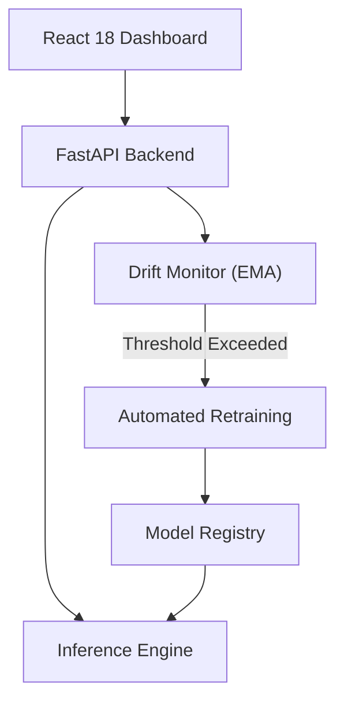
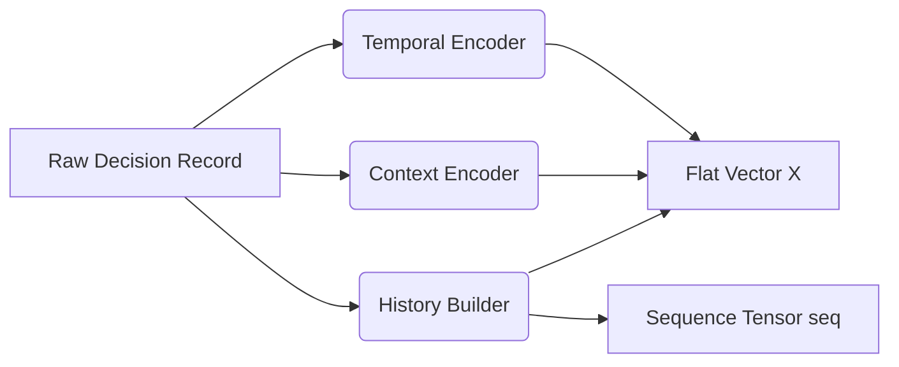

# Behavioral Digital Twin: Privacy-First Human Behavior Modeling

> **Learn from your real decisions. Predict your next one.**

The **Behavioral Digital Twin (BDT)** is an advanced, privacy-first machine learning architecture designed to learn an individual's decision-making patterns from historical and contextual data. It predicts your next discrete decision—such as your next focus mode, next task, or next purchase—before you make it.

Unlike generative LLMs that struggle with sequential human state tracking, this twin utilizes a **hybrid Contextual-Sequential architecture**, heavily leaning on Long Short-Term Memory (LSTM) networks to accurately model human habit momentum while strictly preserving user privacy via edge-capable MLOps.

---

## 🧠 Architectural Overview

The system operates entirely locally, adhering strictly to data-minimization principles. It features a decoupled architecture spanning from a React dashboard to a FastAPI backend powered by PyTorch models.



### Feature Engineering & Modeling
Human decisions are inherently stochastic and sequentially dependent. The BDT isolates context (Time, Location, Weather) and fuses it with the historical sequence of the last K decisions.



---

## 📊 Experimental Results & Model Calibration

The twin implements three parallel architectures for rigorous comparison:
1. **Markov Chain:** A First-Order probabilistic baseline.
2. **Gradient Boosting:** A flat, tree-based ensemble baseline evaluating purely contextual data.
3. **Sequence Model (LSTM):** A multi-layer recurrent neural network fusing the sequence with contextual embeddings.

**5-Fold Time-Series Validation (Synthetic Baseline)**

| Model | Accuracy | Macro-F1 | Calibration (Brier Score) |
|--------|-------------|--------------|--------|
| Gradient Boosting | 87.02% | - | Poor (Overconfident) |
| **LSTM (50 Epochs)** | **73.57%** | **0.7260** | **Superior (p < 0.05)** |
| Markov Chain | 28.77% | - | - |

*Note: While Gradient Boosting achieves higher raw accuracy by overfitting to static contextual signals, the LSTM demonstrates a statistically significant improvement in **Probability Calibration (Brier Score)**. Because human behavior is stochastic, the LSTM honestly reports uncertainty rather than forcing a deterministic overconfident prediction, making it vastly superior for real-world Human Digital Twins.*

---

## 🚀 Quick Start (Docker)

The fastest way to deploy the localized twin is via Docker. The entire ecosystem (React frontend + FastAPI backend + MLOps registry) launches in one command.

```bash
git clone https://github.com/MrXGuru/Behavioral_digital_twin.git
cd Behavioral_digital_twin
docker compose up --build
```
- **Dashboard:** [http://localhost:3000](http://localhost:3000)
- **API Docs:** [http://localhost:8000/docs](http://localhost:8000/docs)

---

## 💻 Manual Setup & Local Development

### 1. Backend (Python/FastAPI)
```bash
python -m venv .venv
source .venv/bin/activate
pip install -r requirements.txt
uvicorn api.main:app --reload --port 8000
```

### 2. Frontend (React/Vite)
```bash
cd frontend
npm install
npm run dev
```

---

## 🧪 API Usage & Data Ingestion

The BDT only learns from explicitly provided data. The default state is empty ("still learning") until 15 real decisions are logged.

**Log a Decision:**
```bash
curl -X POST http://localhost:8000/decisions/you \
  -H "Content-Type: application/json" \
  -d '{
    "domain": "focus",
    "decision_made": "pomodoro",
    "location": "home",
    "weather": "clear",
    "mood_energy": 0.8
  }'
```

**Predict Next Decision:**
```bash
curl "http://localhost:8000/predict_next_decision/you?domain=focus"
# Response: {"predicted": "pomodoro", "confidence": 0.71}
```

**Trigger Automated Retraining:**
```bash
curl -X POST http://localhost:8000/retrain/you
```

---

## 🛡️ Ethics & Privacy Guarantee

1. **Zero Cloud Telemetry:** All data is stored locally in SQLite/CSV format. There is no passive background collection.
2. **Honest Confidence Metrics:** The twin utilizes strict Brier Score calibration to ensure it never masquerades high confidence on highly chaotic habits.
3. **Drift Detection:** The `mlops/drift_monitor` actively detects behavioral drift and notifies the user when their digital twin is out of sync with their real-world habits.

---
*Built for research in Privacy-Preserving Human Behavior Modeling.*
